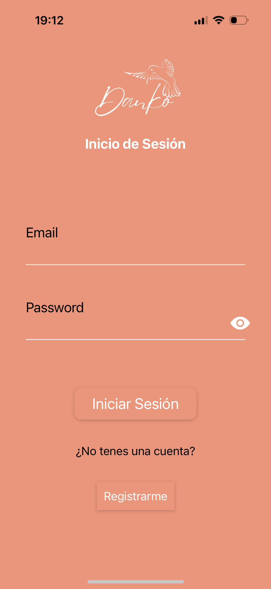
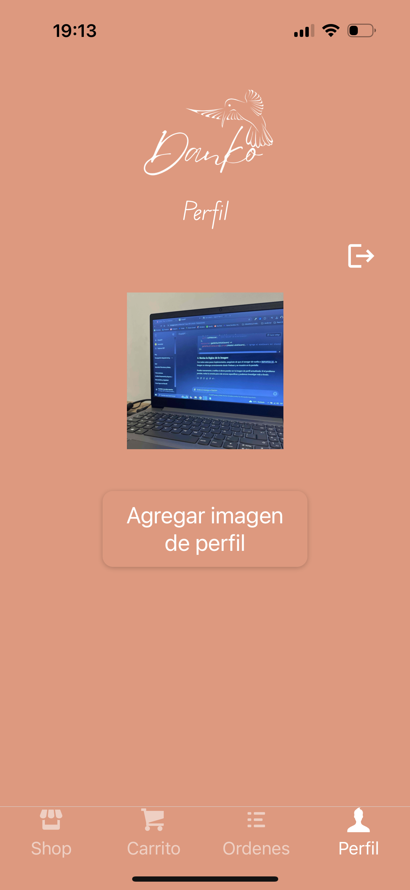
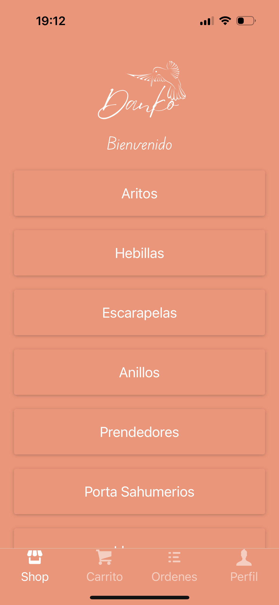
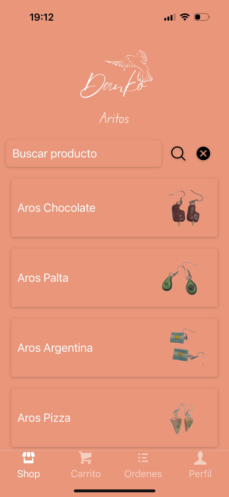
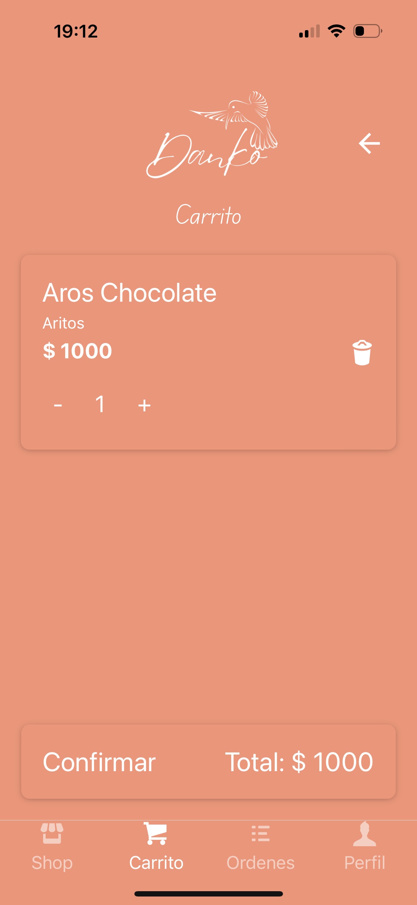

# E-Commerce App - React Native

### Este proyecto es una aplicación de comercio electrónico de una tienda de productos hechos en porcelana fria a mano. La tienda es de mi hermana Lucia y surgió luego del fallecimiento de mi papá en el año 2022, en honor a él. Crear la aplicación de su emprendimiento me pareció una linda manera de homenajear a ambos. Está desarrollada con Reac Native.

### Funcionalidades Principales

### Pantalla de Cuenta
- Acceso seguro: Para poder acceder a la pantalla de perfil y hacer compras en la app es necesario estar registrado.
- Información del usuario: Muestra detalles del usuario, nombre y foto de perfil.

### Autenticación con Firebase

- Utiliza el sistema de autenticación de Firebase para gestionar el acceso de usuarios.
- Permite a los usuarios iniciar sesión y registrarse de manera segura.

### Pantalla de Categorías

- Muestra una selección de categorías en tarjetas.
- Al hacer clic en una categoría, se navega a la pantalla de productos correspondiente.

### Pantalla de Productos

- Lista todos los productos en tarjetas con nombre y foto.
- Incluye un buscador para filtrar productos por nombre.
- Al hacer clic en un producto, se navega a la pantalla de detalles del producto.

### Pantalla de Detalles del Producto

- Proporciona una descripción detallada del producto.
- Muestra imagen del producto.
- Muestra el precio.
- Permite agregar el producto al carrito.

## Tecnologías Utilizadas

- Firebase Authentication: Implementa el sistema de autenticación de Firebase para gestionar la seguridad de la aplicación.
- React Native Navigation Stack: Gestiona la navegación entre pantallas.
- React Native Navigation Buttom tap: Gestiona la navegación entre pestañas.
- Expo-Location: Permite acceder y gestionar la ubicación del usuario.
- Expo-Picker-Image: Facilita la carga de imágenes de perfil.
- Redux: Centraliza y gestiona el estado de la aplicación.
- RTK Query y Firebase: Realiza operaciones de lectura/escritura en la base de datos.

# Contacto

## 🔗 Links

- **Portfolio**: [https://verostrizinec.github.io](https://verostrizinec.github.io)
- **LinkedIn**: [https://linkedin.com/in/veronica-stri](https://linkedin.com/in/veronica-stri)
- **Email**: [verostrizinec@gmail.com](mailto:verostrizinec@gmail.com)

